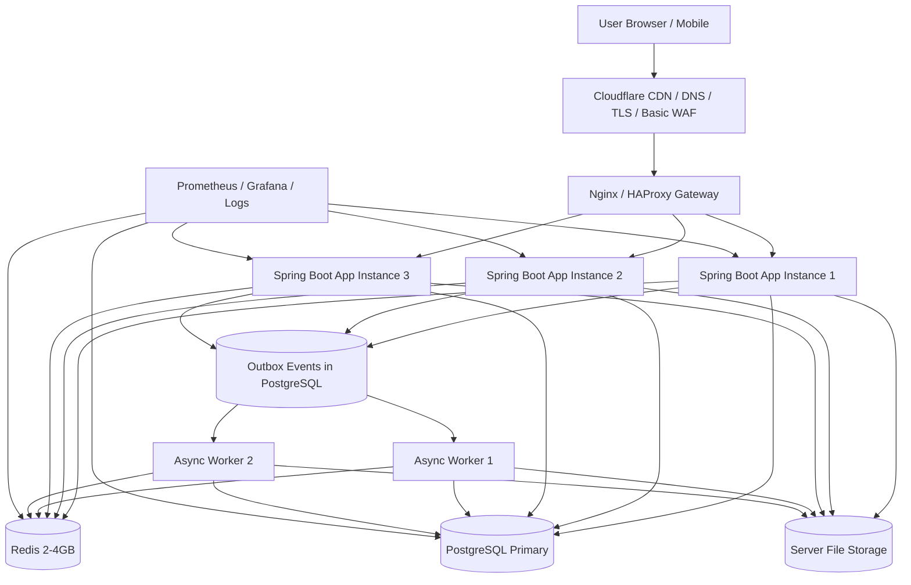
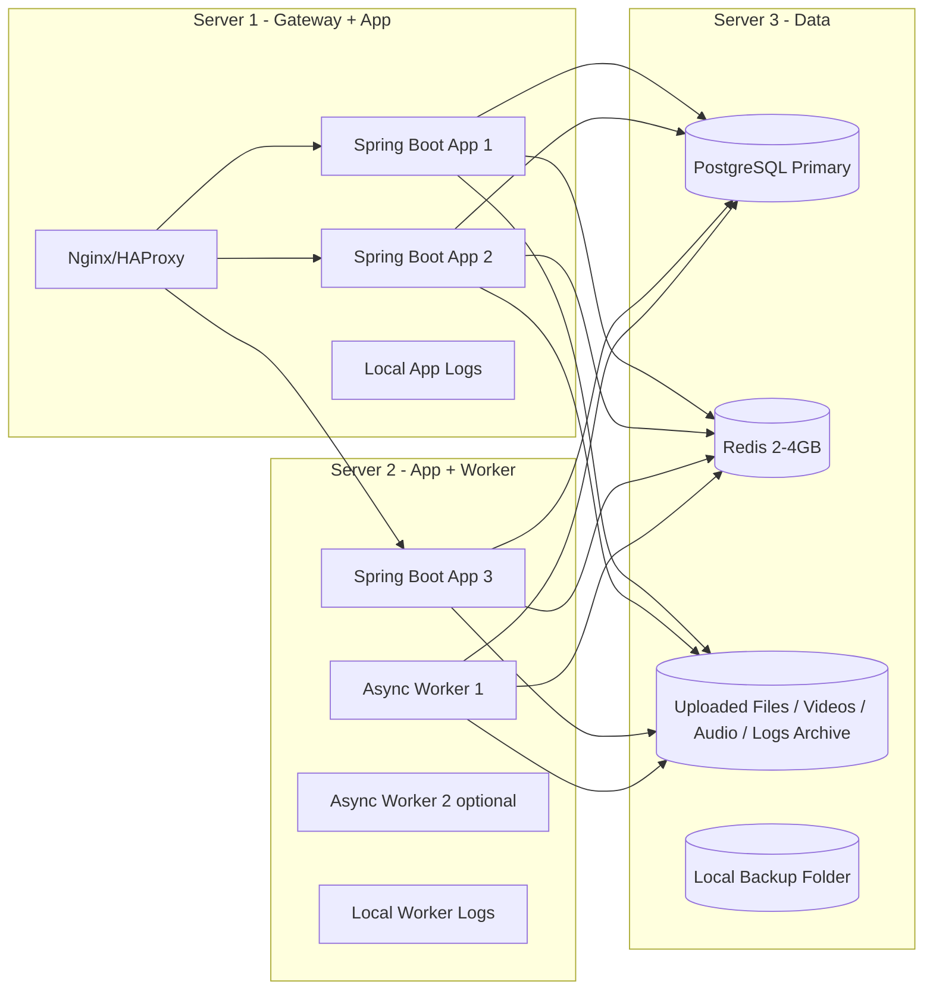
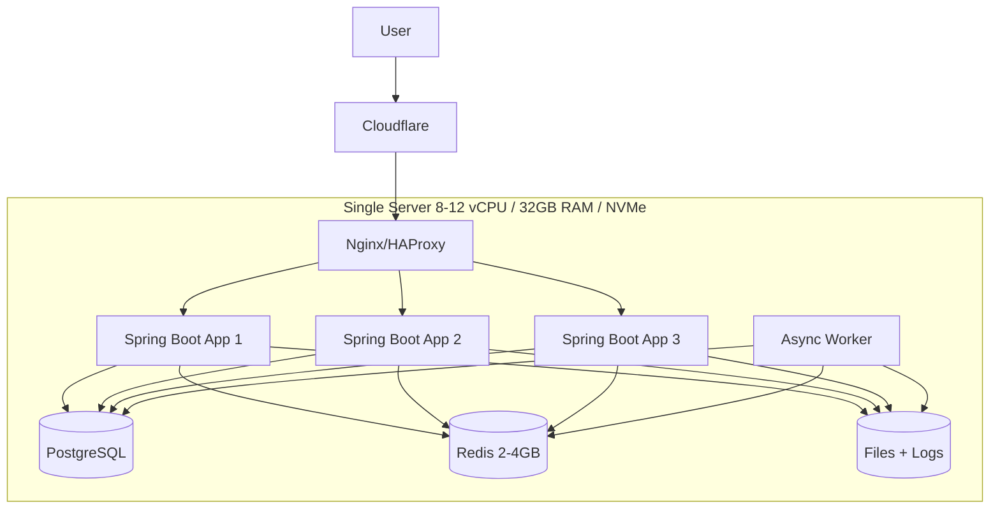
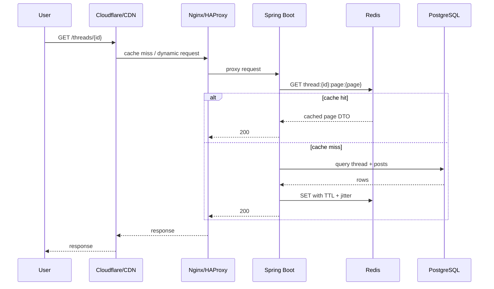
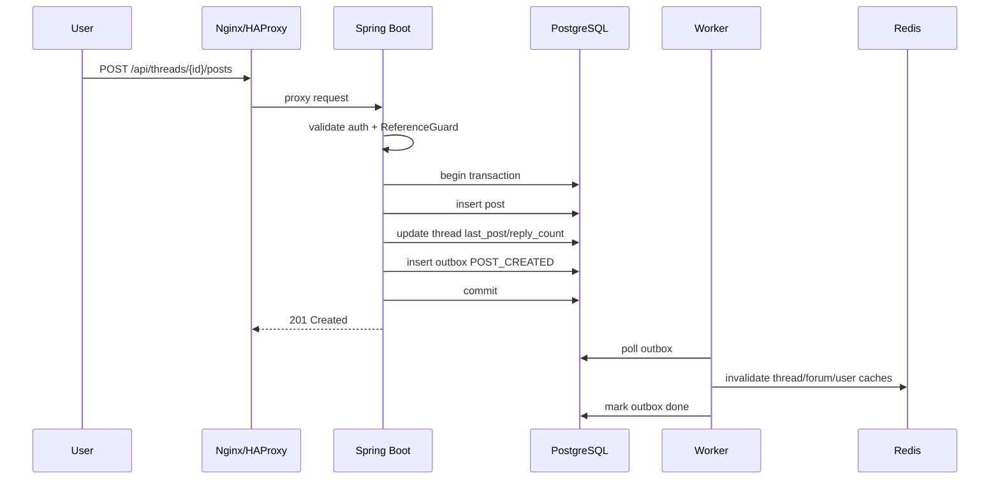
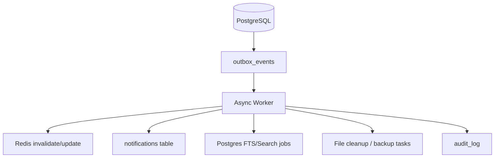

# Thiết kế hệ thống FuOverflow-like

Ngày tạo: 2026-06-02

## 1. Quyết định kiến trúc đã chốt

Hệ thống dùng các thành phần:

- Gateway: Nginx/HAProxy.
- Backend: Java Spring Boot monolith, nhiều instance stateless.
- Database: PostgreSQL primary.
- Cache: Redis 2–4GB.
- Async workers: 1–2 process.
- File phi cấu trúc: lưu trực tiếp trên server.
  - Hình ảnh.
  - Video.
  - Tệp âm thanh.
  - Attachment.
  - Bản ghi log.

Mục tiêu tải:

- 500–700 request/s.
- Read-heavy workload.
- Chi phí thấp nhất có thể.
- Ưu tiên monolith, không microservice sớm.
- Không dùng DB foreign key, validate quan hệ trong code.

---

## 2. Sơ đồ tổng quan hệ thống



---

## 3. Sơ đồ thành phần server vật lý/VM

Phương án tiết kiệm nhất: gom nhiều thành phần trên ít server, nhưng vẫn tách app khỏi database nếu có thể.

### 3.1 Khuyến nghị tối thiểu ổn định



### 3.2 Server sizing đề xuất

| Server | Thành phần | Cấu hình gợi ý |
|---|---|---|
| Server 1 | Gateway + App 1/2 | 4 vCPU, 8GB RAM |
| Server 2 | App 3 + Worker | 4 vCPU, 8GB RAM |
| Server 3 | PostgreSQL + Redis + File storage | 6–8 vCPU, 24–32GB RAM, SSD/NVMe |

Nếu cực kỳ tiết kiệm, có thể gom tất cả vào 1 server mạnh. Nhưng rủi ro cao: DB, Redis, app, file IO tranh tài nguyên.

### 3.3 Phương án 1 server siêu tiết kiệm



Chỉ nên dùng nếu chấp nhận downtime khi server lỗi.

---

## 4. Request flow

### 4.1 Read public thread



### 4.2 Create post



---

## 5. Gateway thiết kế

Gateway dùng Nginx hoặc HAProxy.

Nhiệm vụ:

- TLS termination.
- Reverse proxy tới Spring Boot instances.
- Load balancing.
- Rate limiting.
- Request timeout.
- Body size limit.
- Compression.
- Block public access tới `/actuator/**`.
- Serve static file nếu file nằm trên cùng server.
- Forward real IP header.

### 5.1 Route

| Path | Target |
|---|---|
| `/api/**` | Spring Boot app |
| `/threads/**` | Spring Boot app hoặc SSR response |
| `/forums/**` | Spring Boot app |
| `/assets/**` | static/CDN/local file |
| `/uploads/**` | server file storage |
| `/actuator/**` | block public |

### 5.2 Rate limit

| Endpoint group | Anonymous | Logged-in |
|---|---:|---:|
| Public GET | 120 req/min/IP | 300 req/min/user |
| Search | 20 req/min/IP | 60 req/min/user |
| Login | 5 req/min/IP | 10 req/min/user |
| Register | 3 req/min/IP | 5 req/min/user |
| Create post/comment | blocked | 30 req/min/user |
| Reaction/bookmark | blocked | 120 req/min/user |
| Upload | blocked | 10 req/min/user |

---

## 6. Spring Boot monolith

### 6.1 Module code

```txt
auth
user
forum
thread
post
reaction
notification
award
membership
course
material
payment
search
moderation
admin
common
```

### 6.2 App instances

Initial:

```txt
3 Spring Boot instances
2 vCPU / 4GB RAM each
```

JVM gợi ý:

```txt
-Xms1g -Xmx2g
```

### 6.3 Hikari pool

```yaml
spring:
  datasource:
    hikari:
      maximum-pool-size: 15
      minimum-idle: 5
      connection-timeout: 3000
      idle-timeout: 600000
      max-lifetime: 1800000
```

Với 3 app:

```txt
3 x 15 = 45 DB connections
```

Nếu scale > 6 app, cân nhắc PgBouncer.

### 6.4 Actuator

Expose private only:

```txt
/actuator/health/liveness
/actuator/health/readiness
/actuator/prometheus
```

---

## 7. Redis cache

Redis 2–4GB dùng cho:

- Session/token metadata.
- Rate limit counters.
- Hot thread pages.
- Forum/category tree.
- Feed pages.
- User mini profile.
- Reaction counts.
- View counters buffer.
- Entitlements/access cache.
- Award definitions.
- Course outlines.
- Material metadata.

### 7.1 Key design

```txt
forum:tree:v1
forum:{forumId}:meta:v1
category:{categoryId}:meta:v1
forum:{forumId}:threads:p:{cursor}:v1
category:{categoryId}:threads:p:{cursor}:v1

thread:{threadId}:meta:v1
thread:{threadId}:posts:p:{page}:v1
thread:{threadId}:first-page:v1
thread:{threadId}:last-page:v1
post:{postId}:rendered:v:{editVersion}

user:{userId}:mini:v1
user:{userId}:profile:v1
user:{userId}:roles:v1
user:{userId}:entitlements:v1
user:{userId}:awards:v1

course:catalog:p:{page}:v1
course:{courseId}:outline:v1
course:{courseId}:meta:v1
lesson:{lessonId}:rendered:v:{editVersion}
material:{materialId}:meta:v1
user:{userId}:course:{courseId}:access:v1

search:{queryHash}:p:{page}:v1
search:suggest:{prefix}:v1

auth:session:{sessionId}
rate:{scope}:{id}:{window}

counter:thread:{threadId}:views
counter:thread:{threadId}:replies
counter:post:{postId}:reactions
counter:user:{userId}:points
```

### 7.2 TTL đề xuất

| Cache | TTL |
|---|---:|
| Forum tree | 5–30 phút |
| Thread list | 30–120s |
| Thread page | 30–120s |
| Rendered post HTML | 5–60 phút |
| User mini profile | 1–10 phút |
| Roles/entitlements | 30–120s |
| Course catalog | 1–5 phút |
| Course outline | 5–30 phút |
| Search results | 30–300s |
| Session | theo session expiry |
| Rate limit | theo window |

### 7.3 Chống cache stampede

Bắt buộc có:

- TTL jitter ±10–20%.
- Per-key rebuild lock.
- Single-flight request coalescing.
- Serve stale while rebuild.
- Prewarm hot pages sau deploy.

### 7.4 Invalidation

Không global flush.

Write flow:

```txt
DB transaction commit
  -> insert outbox event
  -> worker reads event
  -> invalidate affected keys
  -> update search/counters/notifications
```

---

## 8. PostgreSQL primary

PostgreSQL là source of truth.

Nguyên tắc:

- Không dùng foreign key constraints.
- Vẫn dùng primary key, unique, check, not null, index.
- Validate quan hệ trong code.
- Soft delete thay hard delete.
- Keyset pagination.
- Short transaction.
- Slow query logging.
- Backup/PITR nếu có thể.

### 8.1 No-FK validation strategy

Tạo `ReferenceGuard` trong code:

```java
public interface ReferenceGuard {
    void requireActiveUser(UUID userId);
    void requireForumExists(UUID forumId);
    void requireCategoryExists(UUID categoryId);
    void requireThreadOpen(UUID threadId);
    void requireCoursePublished(UUID courseId);
    void requireMaterialExists(UUID materialId);
    void requireMembershipPlanActive(UUID planId);
    void requireRoleExists(UUID roleId);
}
```

Rules:

- Controller không được ghi trực tiếp raw ID.
- Service layer validate trước khi write.
- Validate + write trong transaction.
- Dùng `SELECT FOR UPDATE` khi parent state có thể đổi.
- Daily orphan scanner.
- Admin repair tool.

---

## 9. File storage trực tiếp trên server

User đã chốt: file phi cấu trúc lưu trực tiếp trên server.

### 9.1 Cấu trúc thư mục

```txt
/data/fuoverflow/
  uploads/
    avatars/
      yyyy/mm/dd/{uuid}.{ext}
    images/
      yyyy/mm/dd/{uuid}.{ext}
    videos/
      yyyy/mm/dd/{uuid}.{ext}
    audio/
      yyyy/mm/dd/{uuid}.{ext}
    attachments/
      yyyy/mm/dd/{uuid}.{ext}
  logs/
    app/
    worker/
    nginx/
    archive/
  backups/
    postgres/
    redis/
    uploads/
  tmp/
```

### 9.2 Metadata trong DB

File thật nằm trên disk, metadata nằm bảng `materials` hoặc `uploaded_files`.

Lưu:

- `storage_path`.
- `mime_type`.
- `size_bytes`.
- `checksum_sha256`.
- `owner_user_id`.
- `visibility`.

### 9.3 Rủi ro khi lưu file local

| Rủi ro | Giảm thiểu |
|---|---|
| Server hỏng mất file | backup uploads hằng ngày |
| Disk đầy | alert disk >80%, quota upload |
| IO tranh với DB | tốt nhất tách DB disk và upload disk |
| Scale nhiều app khó đọc chung file | dùng shared mount/NFS hoặc route upload về 1 file server |
| Video traffic nặng | dùng Nginx static + CDN cache |
| Log phình to | logrotate + retention |

### 9.4 Nginx serve file

Static file nên để Nginx serve, không stream qua Spring Boot.

```txt
/uploads/** -> Nginx alias /data/fuoverflow/uploads/
```

Private file nên đi qua Spring Boot kiểm tra quyền rồi trả `X-Accel-Redirect` cho Nginx serve nội bộ.

Flow private download:

```txt
User -> Spring Boot /api/materials/{id}/download
Spring Boot validates entitlement
Spring Boot returns X-Accel-Redirect: /protected-files/path
Nginx serves file from disk
```

---

## 10. Async workers

Worker xử lý:

- Outbox events.
- Cache invalidation.
- Email.
- Notification fanout.
- Search indexing.
- View counter flush.
- Award evaluation.
- Orphan scanner.
- Payment reconciliation.
- File cleanup.

### 10.1 Worker diagram



---

## 11. Search

MVP dùng PostgreSQL full-text search.

Search sources:

- `threads.title`.
- `posts.body_md`.
- `courses.title`, `courses.description_md`.
- `materials.title`, `materials.description`.

Khi scale lớn mới dùng Meilisearch/OpenSearch.

---

## 12. Security

- Password: Argon2id hoặc bcrypt.
- Cookie session: SameSite=Lax/Strict, Secure, HttpOnly.
- CSRF cho write endpoints nếu dùng cookie.
- CORS allowlist.
- Markdown sanitize server-side.
- Không render raw HTML user nhập.
- Upload validate MIME + size + checksum.
- Login/register rate limit.
- Admin audit log.
- Payment webhook signature validation.

---

## 13. Monitoring

Metrics bắt buộc:

- API p50/p95/p99 latency.
- Error rate.
- RPS by endpoint.
- DB query latency.
- DB CPU/memory/connections.
- Redis hit rate.
- Redis memory/evictions.
- Queue lag.
- Outbox failed jobs.
- Cache rebuild time.
- JVM heap/GC.
- Disk usage.
- File upload volume.

Alerts:

| Signal | Threshold |
|---|---:|
| API error rate | > 0.5–1% |
| API p95 cached read | > 200ms |
| API p95 write | > 500ms |
| DB CPU | > 70% sustained |
| DB connections | > 80% max |
| Redis evictions | > 0 |
| Redis p95 | > 5–10ms |
| Queue lag | > 5 phút |
| Disk | > 80% |
| Backup failure | any |

---

## 14. Load test plan

Stages:

```txt
100 rps -> 300 rps -> 500 rps -> 700 rps -> 1000 rps
```

Scenario mix:

```txt
60% GET home/forum/thread list
20% GET thread page
5% search
5% login/profile/user
5% reaction/bookmark
3% create post/comment
2% course/material/payment-like endpoints
```

Pass criteria:

```txt
p95 cached GET < 200ms
p95 DB-backed GET < 400ms
p95 write < 500ms
error rate < 0.5%
DB CPU < 70%
Redis hit ratio hot endpoints > 80%
no Redis eviction
queue lag stable
disk IO not saturated
```

---

## 15. Scale triggers

| Hiện tượng | Hành động |
|---|---|
| App CPU >65%, DB khỏe | thêm app instance |
| DB query p95 >50–100ms | EXPLAIN, thêm index, sửa query |
| DB CPU >70% sustained | tăng DB vertical hoặc read replica |
| DB connection full | PgBouncer, giảm pool |
| Redis evictions >0 | tăng memory hoặc giảm payload cache |
| Redis hit thấp | sửa key/TTL/cache admission |
| Queue lag tăng | thêm worker |
| Disk >80% | cleanup, tăng disk, chuyển file sang object storage nếu cần |
| Video bandwidth cao | CDN cache file public |

---

## 16. Kết luận

Kiến trúc đã chốt phù hợp mục tiêu 500–700 rps nếu:

- CDN/Nginx xử lý static/public traffic tốt.
- Redis đạt hit ratio cao cho hot endpoints.
- PostgreSQL query có index đúng.
- Spring Boot instances stateless.
- File lớn được Nginx serve, không stream qua app.
- Worker xử lý async và invalidation chuẩn.
- No-FK được bù bằng ReferenceGuard + orphan scanner + soft delete.
